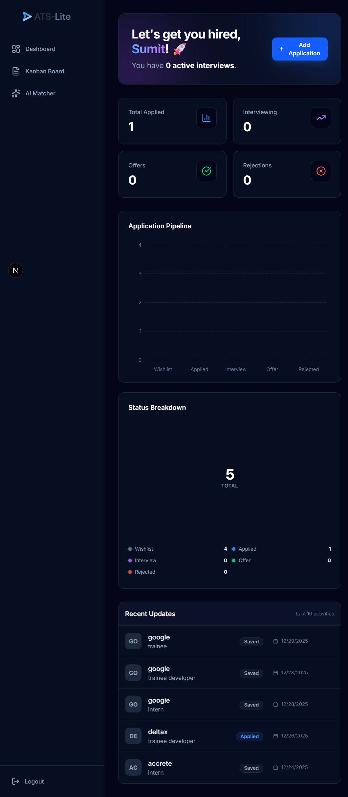
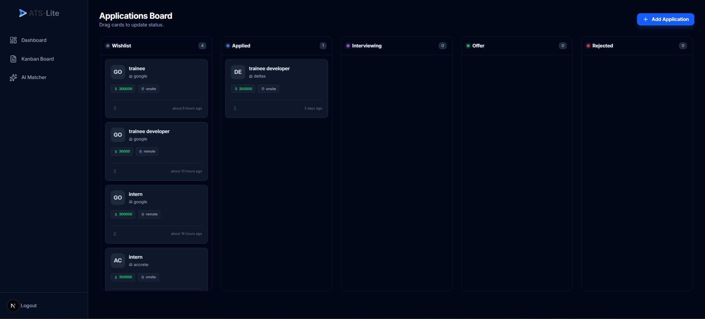
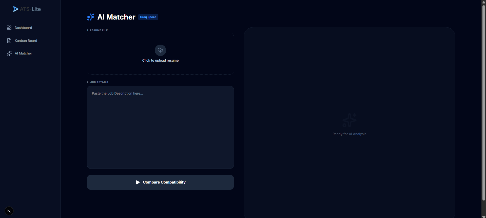
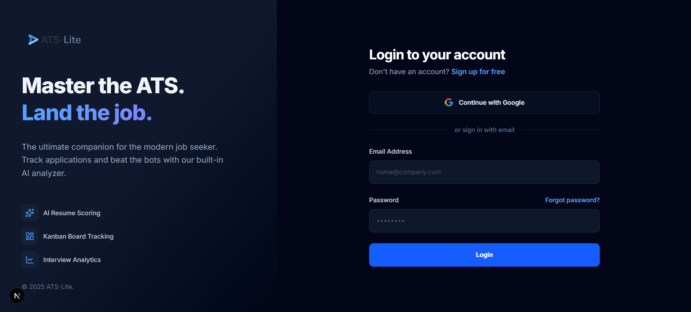

# 🚀 ATS-Lite — AI-Powered Applicant Tracking System

ATS-Lite is a modern, enterprise-grade Applicant Tracking System that streamlines recruitment by combining a secure dashboard with an AI-powered resume analyzer for real-time PDF parsing and candidate evaluation.

## 🔗 Live Demo

https://<your-app-name>.azurewebsites.net

## 📸 Screenshots

### Dashboard

### Kanban Board

### AI Resume Analyzer

### Authentication

## ✨ Core Features

- Secure authentication using Supabase Auth
- Kanban-style dashboard for tracking job applications
- AI-powered resume parsing and candidate scoring
- Azure App Service deployment with GitHub Actions CI/CD

## 🛠️ Technology Stack

### Frontend

- Next.js 15 (App Router)
- TypeScript
- Tailwind CSS
- Lucide React

### Backend & AI

- Supabase (PostgreSQL + Row Level Security)
- Groq SDK
- Llama 3.3 70B
- pdf2json

## 🚀 Getting Started

### Prerequisites

- Node.js v18 or higher
- Supabase account
- Groq API key

### Installation

#### Clone the repository

    git clone https://github.com/PrimeSumit/ATS-Lite.git
    cd ats-lite

#### Install dependencies

    npm install

#### Configure environment variables

Create a `.env.local` file in the project root directory:

    NEXT_PUBLIC_SUPABASE_URL=your_supabase_url
    NEXT_PUBLIC_SUPABASE_ANON_KEY=your_supabase_anon_key
    GROQ_API_KEY=your_groq_api_key

#### Run the development server

    npm run dev

#### Open the application in your browser:

    http://localhost:3000
